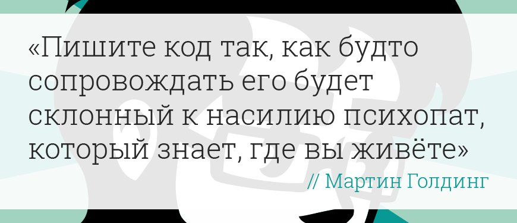
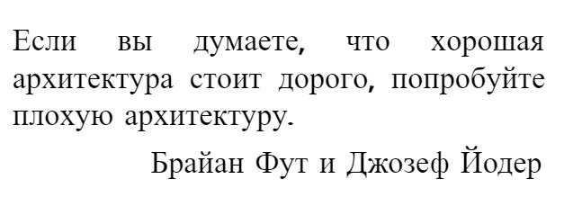

# Материалы для самостоятельного обучения

## Привет, случайно заглянувший) Вот тебе пара моих любимых цитат

## А теперь, если тебе стало интересно что посмотреть что почитать или где поискать практические задачи,
## ниже мой список рекомендуемой литературы, каналов на Youtube и сайтов с бесплатными уроками

Подборка книг

    SQL Основы
        Шилдс У.
		    SQL. Быстрое погружение [2022]
        Хохлов И.Л.
		    Самоучитель. Курс SQL. Базы данных. ORACLE [2023]
        Лузанов П.В., Рогов Е.В., Лёвшин П.В.
		    Postgres. первое знакомство [2023]
        Моргунов Е.П.
		    PostgreSQL. Основы языка SQL [2018]
        Новиков Б.А., Горшкова Е.А., Графеева Н.Г.
		    Основы технологий баз данных [2020]
        Рогов Е.В.
		    PostgreSQL 15 изнутри [2023]
    SQL Оптимизация
        Дейт К.
		    SQL и реляционная теория. Как грамотно писать код на SQL [2010]
        Домбровская Г., Новиков Б., Бейликова А.
		    Оптимизация запросов в PostgreSQL [2022]
        Миллсап К., Хольт Д.
		    Oracle. Оптимизация производительности [2006]
        Шварц Б., Зайцев П., Ткаченко В., Заводны Дж., Ленц А., Бэллинг Д.
		    MySQL. Оптимизация производительности [2010]
    Pandas
        Хейдт М.
		    Изучаем Pandas [2018]
    Airflow
        Харенслак Б., де Руйтер Дж.
		    Apache Airflow и конвейеры обработки данных [2022]
    Правильный кодинг
        Мартин Р.
		    Идеальный программист. Как стать профессионалом разработки ПО [2012]
            Чистый код. Cоздание, анализ и рефакторинг [2019]
            Чистая архитектура. Искусство разработки программного обеспечения [2018]
            Чистый Agile. Основы гибкости [2020]

Каналы на Youtube

    Prime Soft
	    Уроки SQL с новичка до профессионала. Базы данных, ORACLE, MySQL, MS SQL Server. Уроки программирования. Microsoft Excel, уроки Эксель. Delphi.
	        https://www.youtube.com/@PrimeSoft
    Ulbi TV
	    Канал Fullstack разработчика Ульби Тимура. Видео уроки по программированию, много полезного по разным темам, javascript, backend, frontend, базы данных, алгоритмы и многое другое!
	        https://www.youtube.com/@UlbiTV
    Диджитализируй!
	    Канал Алексея Голобурдина, основателя digitalize.team и Salesbeat, много полезного, интересная подача материала.
	        https://www.youtube.com/@t0digital
    Школа Больших Данных
	    Видео канал учебного центра «Школа Больших Данных»  (ООО "Учебный центр "Коммерсант")
	        https://www.youtube.com/@BigDataSchool

- Бесплатные курсы
  [Упражнения по SQL. Практическое владение языком SQL](https://www.sql-ex.ru)
  [Хендбуки Академии Яндекса. Бесплатные онлайн-учебники для тех, кто хочет освоить ключевые IT-дисциплины](https://academy.yandex.ru/handbook)
  [LeetCode. A New Way to Learn](https://leetcode.com)
